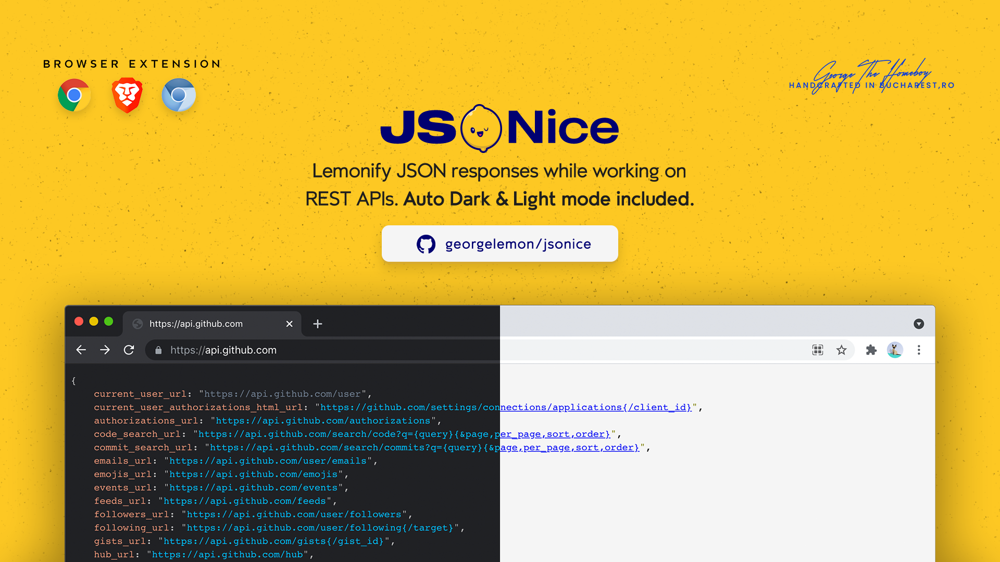

# JSONice
Beautifying JSON strings when working on REST APIs. Dark &amp; Light mode included.

Note that JSONice will look only for pages with **contentType** set as <code>application/json</code>.

### Roadmap
- [x] Dark/Light mode
- [x] Catch JSON errors
- [ ] Filtering
- [ ] Toggle JSON Blocks
- [ ] Publish JSONice in Webstore

## Installing
Go to <code>chrome://extensions/</code>, Toggle <code>Developer Mode</code>, open Load unpacked popup and select the parent <code>src</code> directory.